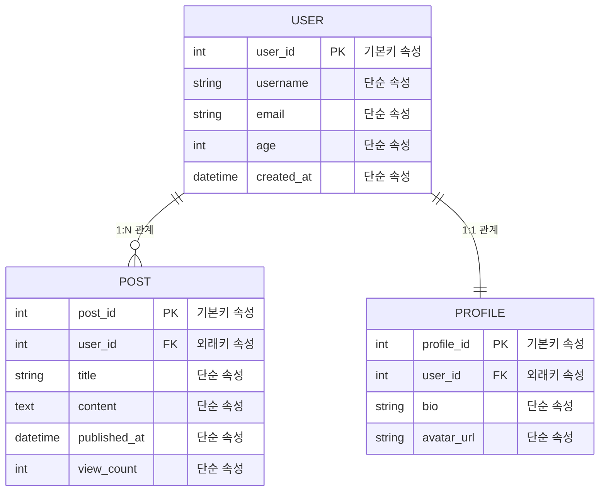

<div align="center">

# **DB(DataBase)**

데이터 저장소     
여러 사람이 공유하여 사용할 목적으로 체계화해 통합, 관리하는 데이터의 집합
    

[환경설정](https://github.com/yi5oyu/DB/tree/main/%ED%99%98%EA%B2%BD%EC%84%A4%EC%A0%95) • [SQL](https://github.com/yi5oyu/DB/blob/main/SQL/README.md) • [DB 접근 기술](https://github.com/yi5oyu/DB/blob/main/JPA/%EC%A0%91%EA%B7%BC%EA%B8%B0%EC%88%A0.md) • [JPA](https://github.com/yi5oyu/DB/new/main/JPA/README.md)

| [DBMS](#dbmsdatabase-management-system) • [RDB](#관계형-데이터베이스rdb) • [SQL](#sqlstructured-query-language) • [트랜잭션](#트랜잭션transaction) • [인덱스](#인덱스index) • [NoSQL](#nosqlnot-only-sql) • [클라우드 DB](#클라우드-데이터베이스) • [Web Storage](#web-storage) |

</div>

## 메모리 vs 파일 vs DB

| 구분 | 메모리 저장 | 파일 저장 | 데이터베이스 저장 |
|------|-------------|-----------|-------------------|
| **속도** | 매우 빠름 | 느림(파일 읽고/쓰기) | 빠름(인덱스) |
| **영속성** | 휘발성 | 영구 보존 | 영구 보존 |
| **용량** | 메모리 제한 | 디스크 용량만큼 | 대용량 처리 |
| **동시 접근** | 동시성 문제 | 충돌 위험 | 트랜잭션 제어 |
| **검색** | 복잡한 검색 어려움 | 전체 파일 스캔 | 복잡한 쿼리 지원 |
| **백업** | 불가능 | 파일 복사 | 전용 백업 도구 |
| **무결성** | 보장 어려움 | 파일 손상 위험 | 제약조건으로 보장 |
| **설정 복잡도** | 간단 | 간단 | 복잡한 설정 필요 |
| **비용** | 메모리 비용 높음 | 저렴 | 라이선스/관리 비용 |

**메모리**: 임시 데이터, 캐시, 실시간 처리     
**파일**: 설정 정보, 로그, 단순한 데이터     
**DB**: 복잡한 비즈니스 데이터, 다중 사용자 환경      

## DBMS(Database Management System)

    데이터베이스를 효율적으로 관리해주는 소프트웨어
    쿼리 최적화, 동시성 제어, 데이터 복구, 메모리 관리

### DBMS 아키텍처

1. 애플리케이션(Application): `DB를 사용하는 모든 프로그램`      
 : SQL 전송
   
2. SQL 인터페이스: `SQL 명령어 작성`    
 : 인증 및 권한 확인 -> SQL 명령어 추출 -> Query Processor로 전달

3. 쿼리 프로세서(Query Processor): `QL을 실행 가능한 계획으로 변환`      
 : 구문 분석 -> 의미 분석(테이블/칼럼 존재 여부 확인/호환성 검사) -> 쿼리 최적화 -> 실행 계획 생성

4. 트랜잭션 관리자(Transaction Manager): `ACID 보장`       
 : 트랜잭션 시작/커밋/롤백, 동시성 제어, 로그 관리, 데드락 감지/해결

5. 저장 엔진(Storage Engine): `실제 데이터 읽기/쓰기`     
 : 버퍼 풀, 페이지 관리  

6. 물리적 저장소(Physical Storage): `실제 데이터 저장`       
 : 데이터 파일(.ibd), 인덱스 파일, 로그 파일, 파티셔닝, I/O 최적화

<!-- 
### DBMS 종류, 특징

| DBMS | 회사/라이선스 | 특징 | 주요 용도 |
|------|---------------|------|-----------|
| **H2** | 오픈소스 | 메모리/파일 | 개발, 테스트 |
| **Oracle** | Oracle | 최고 성능 | 대기업, 미션크리티컬 |
| **MySQL** | Oracle | 빠르고 간단 | 웹 개발, 스타트업 |
| **PostgreSQL** | 오픈소스 | 고급 기능 풍부 | 엔터프라이즈, 복잡한 쿼리 |
| **MS SQL Server** | Microsoft | .NET 연동 | 윈도우 환경 |
| **SQLite** | 오픈소스 | 파일 기반 | 모바일, 임베디드 |
-->

## 관계형 데이터베이스(RDB)

    테이블 간의 관계를 기반으로 데이터를 저장

`테이블`

```
          열 Column Field Attribute  
        ┌────┬──────────┬─────────────────┬────────┐
 행     │ id │ username │ email           │ age    │ 
 Row    ├────┼──────────┼─────────────────┼────────┤
 Record │ 1  │ a        │ a@gmail.com     │ 20     │
 Tuple  │ 2  │ b        │ b@gmail.com     │ 30     │ 
        │ 3  │ c        │ c@gmail.com     │ 40     │
        └────┴──────────┴─────────────────┴────────┘
```

`관계`

| 관계 유형 | 설명 | 특징 |
|-----------|------|------|
| **1:1** | 한 레코드가 다른 테이블의 정확히 하나의 레코드와 연결 | 테이블 분리 목적 |
| **1:N** | 한 레코드가 다른 테이블의 여러 레코드와 연결 | 가장 일반적인 관계 |
| **N:M** | 양쪽 테이블의 레코드가 서로 여러 개와 연결 | 중간 테이블 필요 |

`키`

| 키 유형 | 설명 | 특징 |
|---------|------|------|
| **기본키(Primary Key)** | 각 행을 고유하게 식별하는 키 | 중복 불가, NULL 불가, 테이블당 1개 |
| **외래키(Foreign Key)** | 다른 테이블의 기본키를 참조하는 키 | 참조 무결성 보장, 관계 연결 |
| **후보키(Candidate Key)** | 기본키가 될 수 있는 모든 키 | 유일성, 최소성 만족 |
| **대체키(Alternate Key)** | 기본키로 선택되지 않은 후보키 | 기본키의 대안 |
| **복합키(Composite Key)** | 여러 컬럼을 조합한 키 | 단일 컬럼으로 식별 불가능할 때 |
| **슈퍼키(Super Key)** | 행을 고유하게 식별할 수 있는 모든 키 조합 | 최소성 조건 없음 |

### 테이블 설계

#### 정규화(Normalization)

    중복 데이터를 제거해 데이터 일관성, 저장 효율성 높이는 과정

`정규화 단계`

```
1NF: 원자값만 저장(반복 그룹 제거)
2NF: 부분 함수 종속 제거(기본키 일부에만 종속된 속성 분리)
3NF: 이행 함수 종속 제거(기본키가 아닌 속성 간 종속성 제거) // 일반적인 정규화 적용
BCNF: 모든 결정자가 후보키
4NF: 다치 종속 제거(독립적인 다대다 관계 분리)
5NF: 조인 종속성 제거(무손실 분해)
6NF: 이론적 정규화(표준화되지 않음, 시간적 데이터 처리)
```

> 역정규화: 성능 향상을 위해 의도적으로 중복을 허용(조회 속도 vs 데이터 일관성)

#### ERD(Entity Relationship Diagram)

    데이터베이스 구조를 시각적으로 표현하는 다이어그램

`데이터 모델링`

- **개념적 모델링**: 업무 요구사항을 개체와 관계로 표현
- **논리적 모델링**: 정규화를 적용하여 테이블 구조 설계
- **물리적 모델링**: 실제 DBMS에 구현할 구조로 변환
  
`엔티티(Entity)`: 각 테이블(USER, POST, PROFILE)    
`속성(Attribute)`: 각 엔티티 내부의 필드     
`관계(Relationship)`: 엔티티 간 연결선     
`도메인(Domain)`: 속성이 가질 수 있는 값의 범위



#### 스키마

    데이터베이스의 구조와 제약조건을 정의하는 설계도

`스키마 3계층 구조`

**데이터 독립성을 제공하기 위한 DBMS의 논리적 구조 분리 방식**

`외부 스키마(External Schema)`: 사용자 관점(개별 사용자/응용프로그램이 보는 DB 구조)
> 사용자는 SQL을 이용하여 DB를 쉽게 사용

`개념 스키마(Conceptual Schema)`: 설계자 관점(전체 데이터베이스의 논리적 구조)
> 데이터베이스 관리자가 전체 테이블, 관계, 제약조건 관리

`내부 스키마(Internal Schema)`: 시스템 관점(데이터의 물리적 저장 방식)

```sql
-- 외부 스키마(사용자 뷰)
CREATE VIEW customer_info AS
SELECT username, email FROM users WHERE is_active = TRUE;

-- 개념 스키마(전체 테이블 구조)  
CREATE TABLE users (user_id INT PRIMARY KEY, username VARCHAR(50)...);

-- 내부 스키마(물리적 저장)
-- 파일: /data/mysql/users.ibd, B+ Tree 인덱스
```

```
처리과정
1. 사용자 요청: SELECT * FROM customer_info
2. 외부 스키마: customer_info 뷰 해석
3. 개념 스키마: users 테이블 참조
4. 내부 스키마: /data/users.ibd 파일 읽기
5. 결과 반환: 고객 정보 리스트
```

`데이터 독립성`

**논리적 데이터 독립성**
- 개념 스키마 변경해도 외부 스키마 영향 없음
- 테이블 구조 변경해도 사용자 뷰는 그대로 유지

**물리적 데이터 독립성**
- 내부 스키마 변경해도 개념 스키마 영향 없음  
- 저장 방식 변경해도 논리적 구조는 그대로 유지

`스키마 설계`

    ERD를 바탕으로 실제 테이블 구조를 구현하는 과정

```sql
-- 사용자 테이블
CREATE TABLE users (
    user_id BIGINT PRIMARY KEY AUTO_INCREMENT,
    username VARCHAR(50) UNIQUE NOT NULL,
    email VARCHAR(100) UNIQUE NOT NULL,
    password VARCHAR(255) NOT NULL,
);

-- 주문 테이블(users와 1:N 관계)
CREATE TABLE orders (
    order_id BIGINT PRIMARY KEY AUTO_INCREMENT,
    user_id BIGINT NOT NULL,
    total_amount DECIMAL(10,2) NOT NULL,
    order_status ENUM('PENDING', 'CONFIRMED', 'SHIPPED', 'DELIVERED') DEFAULT 'PENDING',
    order_date TIMESTAMP DEFAULT CURRENT_TIMESTAMP,
    FOREIGN KEY (user_id) REFERENCES users(user_id) ON DELETE CASCADE
);

-- 복합 인덱스
CREATE INDEX idx_orders_user_date ON orders(user_id, order_date);
```

## SQL(Structured Query Language)

    관계형 데이터베이스에서 데이터를 관리하기 위한 표준 언어
    데이터 정의, 조작, 제어를 위한 명령어 집합

### SQL 종류

| 분류 | 설명 | 주요 명령어 | 용도 |
|------|------|-------------|------|
| **DDL(Data Definition Language)** | 데이터 구조 정의 | CREATE, ALTER, DROP | 테이블/스키마 생성/수정/삭제 |
| **DML(Data Manipulation Language)** | 데이터 조작 | SELECT, INSERT, UPDATE, DELETE | 데이터 조회/삽입/수정/삭제 |
| **DCL(Data Control Language)** | 접근 권한 제어 | GRANT, REVOKE | 사용자 권한 부여/회수 |
| **TCL(Transaction Control Language)** | 트랜잭션 제어 | COMMIT, ROLLBACK, SAVEPOINT | 트랜잭션 관리 |

**SELECT(조회)**
```sql
SELECT 컬럼명
FROM 테이블명
WHERE 조건
GROUP BY 그룹화_컬럼
HAVING 그룹_조건
ORDER BY 정렬_컬럼;
```
**INSERT(삽입)**
```sql
INSERT INTO 테이블명 (컬럼1, 컬럼2, ...)
VALUES (값1, 값2, ...);
```
**UPDATE(수정)**
```sql
UPDATE 테이블명
SET 컬럼1 = 값1, 컬럼2 = 값2
WHERE 조건;
```
**DELETE(삭제)**
```sql
DELETE FROM 테이블명
WHERE 조건;
```

## [트랜잭션(Transaction)](https://github.com/yi5oyu/Study/blob/main/DB/%EB%8F%99%EC%8B%9C%EC%84%B1/1.%20%ED%8A%B8%EB%9E%9C%EC%9E%AD%EC%85%98)

    여러 데이터베이스 연산을 하나의 논리적 작업 단위로 묶어서 처리
    데이터의 일관성과 무결성을 보장

### ACID

    데이터베이스 트랜잭션이 안전하게 처리되기 위한 4가지 필수 조건
    
```
원자성(Atomicity): 트랜잭션은 전부 성공하거나 전부 실패해야 함
 - COMMIT/ROLLBACK
일관성(Consistency): 트랜잭션 전후에 데이터 무결성 규칙이 유지되어야 함
 - 제약조건, 트리거
격리성(Isolation): 동시 실행되는 트랜잭션들이 서로 영향을 주지 않아야 함
 - 격리 수준, 락
지속성(Durability): 커밋된 트랜잭션의 결과는 영구적으로 저장되어야 함
 - 로그 파일, 백업
```

### 동시성 문제

    여러 트랜잭션이 동시에 실행될 때 발생할 수 있는 문제와 해결 방법

`유형`

`더티 리드(Dirty Read)`: 커밋되지 않은 데이터 읽기(수정 중인 데이터 읽는 경우)         
`반복 불가능 읽기(Non-Repeatable Read)`: 같은 데이터를 다시 읽을 때 다른 값(읽은 데이터가 수정되어 다른 값으로 바뀐 경우)        
`팬텀 리드(Phantom Read)`: 범위 조회 시 새로운 행 출현(조건 검색 후에 새로운 행이 삽입되어 다시 검색할 경우)       

[`격리 수준(Isolation Level)`](https://github.com/yi5oyu/Study/blob/main/DB/%EB%8F%99%EC%8B%9C%EC%84%B1/3.%20%EA%B2%A9%EB%A6%AC%EC%84%B1%20%EB%A0%88%EB%B2%A8)

| 격리 수준 | 더티 리드 | 반복 불가능 읽기 | 팬텀 리드 | 성능 | 사용 사례 |
|-----------|-----------|------------------|-----------|------|-----------|
| **READ UNCOMMITTED** | 발생 | 발생 | 발생 | 최고 | 대용량 로그 분석 |
| **READ COMMITTED** | 방지 | 발생 | 발생 | 높음 | 일반적인 웹 애플리케이션 |
| **REPEATABLE READ** | 방지 | 방지 | 발생 | 보통 | 보고서 생성, 배치 처리 |
| **SERIALIZABLE** | 방지 | 방지 | 방지 | 최저 | 금융 트랜잭션, 결제 시스템 |

[`락(Lock): 동시성 제어를 위해 데이터에 대한 접근을 제한`](https://github.com/yi5oyu/Study/blob/main/DB/%EB%8F%99%EC%8B%9C%EC%84%B1/2.%20%EB%9D%BD)

| 락 종류 | 설명 | 사용 시점 | 특징 |
|---------|------|-----------|--------|
| **공유락(Shared Lock, S)** | 읽기 전용 | SELECT | 여러 트랜잭션이 동시 획득 가능 |
| **배타락(Exclusive Lock, X)** | 쓰기 전용 | INSERT, UPDATE, DELETE | 하나의 트랜잭션만 획득 가능 |
| **의도락(Intent Lock)** | 하위 레벨 락 계획 표시 | 테이블/페이지 레벨 락| 락 충돌 빠른 감지 |    

> 데드락 (Deadlock): 두 개 이상의 트랜잭션이 서로의 락을 기다리며 무한 대기하는 상태            
> 트랜잭션 A: 테이블1 락 획득 -> 테이블2 락 대기, 트랜잭션 B: 테이블2 락 획득 -> 테이블1 락 대기              
> 락 획득 순서 통일/데드락 감지 후 한 트랜잭션 강제 종료           

### Spring Boot

#### [@Transactional](https://github.com/yi5oyu/Study/blob/main/SpringBoot/%EC%96%B4%EB%85%B8%ED%85%8C%EC%9D%B4%EC%85%98/%40Transactional)

`AOP(Aspect-Oriented Programming) 프록시 패턴을 통해 동작`

```
1. 객체 생성
 - @Component, @Service 등이 붙은 클래스 원본 객체 생성/의존성 주입
2. 초기화 후 빈 후처리기(Bean Post Processor)
 - 프록시 생성 및 교체(생성된 빈을 컨테이너에 등록하기 직전에 가로채서 실제 객체 대신 프록시 객체를 빈으로 등록)
  > JDK Dynamic Proxy or CGLIB 프록시 사용
3. 프록시 객체 빈 등록
```

##### 트랜잭션 전파

`이미 트랜잭션이 진행 중일 때 새로운 트랜잭션을 어떻게 처리할지 결정`

```
/*
    REQUIRED(기본값)
    진행 중인 트랜잭션이 있으면 -> 트랜잭션에 참여
    진행 중인 트랜잭션이 없으면 -> 새 트랜잭션 생성
    Spring(TransactionSynchronizationManager)이 ThreadLocal을 사용해서 현재 스레드에 트랜잭션 정보 저장
*/
@Service
public class AService {
    @Autowired
    private BService bService;

    @Autowired
    private ARepository aRepository;

    @Transactional(propagation = Propagation.REQUIRED)
    public void a() {
        aRepository.save(aaa);
        
        // 다른 서비스 호출(트랜잭션 전파 발생)
        bService.b(); 
        
        bRepository.save(bbb);
    }
}
```

## [인덱스(Index)](https://github.com/yi5oyu/Study/blob/main/DB/%EC%84%B1%EB%8A%A5%20%EC%B5%9C%EC%A0%81%ED%99%94/1.%20%EC%9D%B8%EB%8D%B1%EC%8A%A4)

    데이터베이스에서 테이블의 검색 속도를 높이기 위해 사용하는 별도의 정렬된 자료구조
    대용량 데이터에서 빠른 검색을 위한 필수 기능

`인덱스 종류`

`클러스터드 인덱스(Clustered Index)`: 자동 생성 인덱스       
 : 데이터 페이지를 정렬된 순서로 저장

`논클러스터드 인덱스(Non-Clustered Index)`: 일반 인덱스      
 : 별도의 인덱스 구조 생성

[`실행 계획`](https://github.com/yi5oyu/Study/blob/main/DB/%EC%84%B1%EB%8A%A5%20%EC%B5%9C%EC%A0%81%ED%99%94/3.%20%EC%8B%A4%ED%96%89%20%EA%B3%84%ED%9A%8D)
```sql
-- EXPLAIN: 실행 계획 분석 도구    
--  - 인덱스가 제대로 사용되는지 확인하는 핵심 도구
--  - 어떤 인덱스를 사용하는지 확인
--  - 몇 개의 행을 검사하는지 예측
--  - 쿼리 성능 병목지점 파악
--  - 최적화 포인트 발견

EXPLAIN SELECT * FROM users WHERE email = 'a@gmail.com';

-- MySQL 실행 계획 예시
+----+-------------+-------+------+---------------+-----------+---------+-------+------+-------+
| id | select_type | table | type | possible_keys | key       | key_len | ref   | rows | Extra |
+----+-------------+-------+------+---------------+-----------+---------+-------+------+-------+
|  1 | SIMPLE      | users | ref  | idx_email     | idx_email | 767     | const |    1 |       |
+----+-------------+-------+------+---------------+-----------+---------+-------+------+-------+
```

> B-Tree(Balanced-Tree): 대용량 데이터를 효율적으로 저장하고 검색할 수 있도록 설계된 균형 트리(자가 균형 트리)

## NoSQL(Not Only SQL)

    관계형 모델을 사용하지 않는 데이터베이스 시스템
    유연한 스키마와 수평 확장성을 제공하여 대용량, 고성능 애플리케이션에 적합

### NoSQL 종류

| 분류 | 특징 | 데이터 저장 방식 | 대표 DB | 주요 용도 |
|------|------|------------------|---------|-----------|
| **문서형(Document)** | JSON/XML 문서 저장 | 중첩된 구조 | MongoDB, CouchDB | 콘텐츠 관리, API |
| **키-값(Key-Value)** | 단순한 키-값 쌍 | 해시 테이블 | Redis, DynamoDB | 캐시, 세션 저장 |
| **컬럼형(Column-Family)** | 컬럼 기반 저장 | 희소 행렬 | Cassandra, HBase | 시계열 데이터, 로그 |
| **그래프(Graph)** | 노드와 엣지 | 그래프 구조 | Neo4j, ArangoDB | 관계 분석, 추천 |

### 관계형 데이터베이스 vs NoSQL

| 구분 | RDBMS | NoSQL |
|------|-------------------|-------|
| **스키마** | 고정 스키마 | 유연한 스키마 |
| **확장성** | 수직 확장(Scale-Up) | 수평 확장(Scale-Out) |
| **일관성** | 강한 일관성(ACID) | 최종 일관성(BASE) |
| **쿼리** | 복잡한 SQL, JOIN | 단순한 쿼리, No JOIN |
| **트랜잭션** | 완전한 ACID 지원 | 제한적 트랜잭션 |
| **성능** | 복잡한 쿼리에 강함 | 단순한 읽기/쓰기에 강함 |

## 클라우드 데이터베이스

    클라우드 환경에서 제공되는 데이터베이스 서비스
    인프라 관리 부담을 줄이고 확장성, 가용성, 보안을 향상시킴

### 클라우드 DB 서비스 유형

| 서비스 모델 | 설명 | 관리 범위 | 유연성 | 대표 서비스 |
|-------------|------|-----------|--------|-------------|
| **IaaS** | 가상머신에 DB 설치 | 사용자가 모든 것 관리 | 높음 | EC2 + MySQL |
| **DBaaS** | 완전 관리형 DB 서비스 | 클라우드 업체가 관리 | 중간 | RDS, Cloud SQL |
| **Serverless** | 서버리스 DB | 자동 스케일링 | 낮음 | Aurora Serverless |

#### AWS(Amazon Web Services)

| 서비스 | DB 유형 | 특징 | 용도 |
|--------|---------|------|------|
| **RDS** | 관계형 | MySQL, PostgreSQL, Oracle 지원 | 일반적인 웹 애플리케이션 |
| **DynamoDB** | NoSQL (키-값) | 완전 관리형, 밀리초 지연시간 | 게임, IoT, 모바일 |
| **Aurora** | 관계형 | MySQL/PostgreSQL 호환, 고성능 | 엔터프라이즈 애플리케이션 |
| **DocumentDB** | NoSQL (문서형) | MongoDB 호환 | 콘텐츠 관리, 카탈로그 |
| **ElastiCache** | 인메모리 | Redis, Memcached 지원 | 캐싱, 세션 저장 |

## Web Storage

    웹 브라우저에서 클라이언트 데이터 저장을 위한 기술
    서버 DB와 함께 사용하여 성능 최적화와 사용자 경험 향상
    
### localStorage vs sessionStorage vs Cookie

    HTML5 브라우저에서 제공하는 키-값 형태의 간단한 저장소
    서버 요청 없이 클라이언트에서 빠른 데이터 접근 가능

| 구분 | localStorage | sessionStorage | Cookie |
|------|--------------|----------------|--------|
| **지속성** | 명시적 삭제 전까지 영구 저장 | 브라우저 탭 닫으면 삭제 | 설정한 만료일까지 |
| **용량** | 5-10MB | 5-10MB | 4KB |
| **공유 범위** | 같은 도메인의 모든 탭/창 | 해당 탭/창만 | 같은 도메인의 모든 탭/창 |
| **서버 전송** | X | X | 자동 전송 |
| **보안 옵션** | X | X | httpOnly, secure 등 |
| **사용 편의성** | 쉬움 | 쉬움 | 복잡 |
| **주요 용도** | 사용자 설정, 장바구니, 테마 | 임시 데이터, 폼 입력값 | 인증, 추적, 서버 통신 |

#### localStorage

    사용자 설정, 캐시 데이터, 오프라인 지원 등에 사용

```javascript
// 데이터 저장
localStorage.setItem('username', 'a');
localStorage.setItem('settings', JSON.stringify({
    theme: 'dark',
    language: 'ko',
}));

// 데이터 조회
const username = localStorage.getItem('username');
const settings = JSON.parse(localStorage.getItem('settings'));

// 데이터 삭제
localStorage.removeItem('username');
// 모든 데이터 삭제
localStorage.clear();

// 키 존재 확인
if (localStorage.getItem('theme') !== null) {
    // 테마 설정
}
```

#### sessionStorage

    임시 데이터, 폼 상태, 탭별 독립 데이터 저장

```javascript
// 데이터 저장 
sessionStorage.setItem('currentUser', 'a');
sessionStorage.setItem('formData', JSON.stringify({
    title: '임시 제목',
    content: '작성 중인 내용...',
}));

// 데이터 조회
const currentUser = sessionStorage.getItem('currentUser');
const formData = JSON.parse(sessionStorage.getItem('formData'));

// 데이터 삭제
sessionStorage.removeItem('currentUser');
// 모든 데이터 삭제
sessionStorage.clear(); 
// 탭 닫으면 삭제

// 키 존재 확인
if (sessionStorage.getItem('formData') !== null) {
    // 임시 저장된 폼 데이터가 있음
}
```

#### Cookie

    서버와 클라이언트 간 상태 정보 공유, 인증 토큰 저장

```javascript
// 쿠키 설정
document.cookie = "username=a; expires=Thu, 18 Dec 2024 12:00:00 UTC; path=/";
document.cookie = "theme=dark; max-age=3600; secure; samesite=strict";

// 쿠키 조회
function getCookie(name) {
    const value = `; ${document.cookie}`;
    const parts = value.split(`; ${name}=`);
    if (parts.length === 2) return parts.pop().split(';').shift();
    return null;
}
const username = getCookie('username');

// 쿠키 삭제(만료일을 과거로 설정)
document.cookie = "username=; expires=Thu, 01 Jan 1970 00:00:00 UTC; path=/;";

// 쿠키 옵션
// expires: 만료일 설정
// max-age: 초 단위 수명 설정  
// secure: HTTPS에서만 전송
// httpOnly: JavaScript 접근 차단 (서버에서만 설정 가능)
// samesite: CSRF 공격 방지 (strict, lax, none)
```

### IndexedDB 

    브라우저의 고성능 NoSQL 데이터베이스
    대용량 구조화된 데이터 저장과 복잡한 쿼리 지원

| 특징 | 설명 | 장점 | 단점 |
|------|------|------|------|
| **용량** | 수 GB (하드웨어 용량의 50% 이상) | 대용량 데이터 처리 | 메모리 사용량 높음 |
| **데이터 타입** | 객체, 배열, 파일, Blob 등 | 복잡한 데이터 구조 | 직렬화 필요 |
| **트랜잭션** | ACID 지원 | 데이터 일관성 보장 | 복잡한 API |
| **인덱스** | 다중 인덱스 지원 | 빠른 검색 | 인덱스 설계 필요 |
| **비동기** | Promise/async-await 지원 | 메인 스레드 블로킹 없음 | 콜백 지옥 가능성 |
